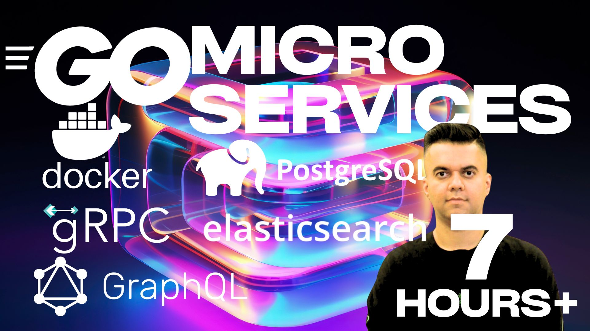

# gRPC Microservices Project with GraphQL API



Follow along with my youtube video - https://www.youtube.com/watch?v=5UIh1dV7aZ8&t=1346s

This project demonstrates a microservices architecture using gRPC for inter-service communication and GraphQL as the API gateway. It includes services for account management, product catalog, and order processing.

Note from akhil - I built this project with the latest GO version and packages, but in this particular code - I have reverted to an older version of GO - why? Across all my production apps, I'm using old versions of GO - simply for more stability and also because I can easy fix if a new issue shows up - many issues prop up in projects with multiple moving parts (and this project has many of them - grpc, graphql, postgres, docker compose, elastisearch and GO) because each of the moving parts keep updating.
If you're a one man team - keep your software manageable with this technique - use versions of software you've previously built with.

## Project Structure

The project consists of the following main components:

- Account Service
- Catalog Service
- Order Service
- GraphQL API Gateway

Each service has its own database:
- Account and Order services use PostgreSQL
- Catalog service uses Elasticsearch

## Getting Started

1. Clone the repository:
   ```
   git clone <repository-url>
   cd <project-directory>
   ```

2. Start the services using Docker Compose:
   ```
   docker-compose up -d --build
   ```

3. Access the GraphQL playground at `http://localhost:8000/playground`

Steps for grpc file generation - 

1. wget https://github.com/protocolbuffers/protobuf/releases/download/v23.0/protoc-23.0-linux-x86_64.zip
2. unzip protoc-23.0-linux-x86_64.zip -d protoc
3. sudo mv protoc/bin/protoc /usr/local/bin/
4. go install google.golang.org/protobuf/cmd/protoc-gen-go@latest
5. go install google.golang.org/grpc/cmd/protoc-gen-go-grpc@latest
6. echo $PATH
7. export PATH="$PATH:$(go env GOPATH)/bin"
8. source ~/.bashrc
9. create the pb folder in your project
10. add this to account.proto - option go_package = "./pb";
11. finally run this command - protoc --go_out=./pb --go-grpc_out=./pb account.proto

## GraphQL API Usage

The GraphQL API provides a unified interface to interact with all the microservices.

### Query Accounts

```graphql
query {
  accounts {
    id
    name
  }
}
```

### Create an Account

```graphql
mutation {
  createAccount(account: {name: "New Account"}) {
    id
    name
  }
}
```

### Query Products

```graphql
query {
  products {
    id
    name
    price
  }
}
```

### Create a Product

```graphql
mutation {
  createProduct(product: {name: "New Product", description: "A new product", price: 19.99}) {
    id
    name
    price
  }
}
```

### Create an Order

```graphql
mutation {
  createOrder(order: {accountId: "account_id", products: [{id: "product_id", quantity: 2}]}) {
    id
    totalPrice
    products {
      name
      quantity
    }
  }
}
```

### Query Account with Orders

```graphql
query {
  accounts(id: "account_id") {
    name
    orders {
      id
      createdAt
      totalPrice
      products {
        name
        quantity
        price
      }
    }
  }
}
```

## Advanced Queries

### Pagination and Filtering

```graphql
query {
  products(pagination: {skip: 0, take: 5}, query: "search_term") {
    id
    name
    description
    price
  }
}
```

### Calculate Total Spent by an Account

```graphql
query {
  accounts(id: "account_id") {
    name
    orders {
      totalPrice
    }
  }
}
```